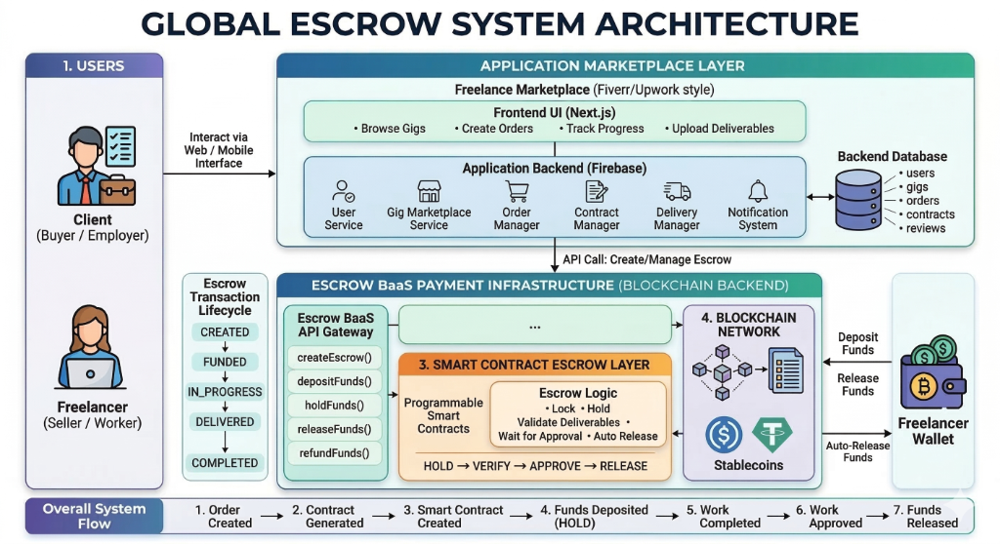

# EscroX: Autonomous Milestone-Based Escrow Engine

EscroX is a next-generation escrow platform designed for the global digital economy. It secures cross-border freelance payments using programmable finance, ensuring that funds are only released when milestone-verified work is submitted and approved.

## 🚀 Technical Vision

Traditional escrow services are slow, expensive, and rely on centralized intermediaries. EscroX solves this by providing:
- **Programmable Trust**: Funds are locked in a transparent, autonomous ledger.
- **Evidence-Based Release**: Payment triggers only upon submission of verifiable work evidence.
- **Hybrid Payouts**: Support for both Web3 (Crypto) and Fiat (via simulated Razorpay integration) to bridge the gap between DeFi and traditional finance.

---

## 🛠 Problem-Solution Mapping

| Problem | EscroX Solution | Technical Implementation |
| :--- | :--- | :--- |
| **Payment Risk** | Autonomous Escrow Vault | Solidity smart contract locks funds until client approval. |
| **Currency Volatility** | Multi-Currency Support | Real-time price feeds and USD-pegged internal accounting. |
| **Dispute Resolution** | Audit Trail & Arbitration | Detailed logs in Firestore + platform-level arbitration functions. |
| **Complex Contract Setup** | AI Contract Drafter | Google Gemini AI automatically structures milestones from project descriptions. |
| **Web3 Friction** | Hybrid Onboarding | Firebase Auth for easy login + optional Web3 wallet connection. |
| **Freelancer Payouts** | Multi-Channel Payouts | Direct on-chain transfers or Fiat payouts to UPI/Bank accounts. |

---

## 🏗 Project Architecture



EscroX follows a modern full-stack architecture combining Web2 speed with Web3 security:

### 1. Smart Contracts (The Trust Layer)
- **Escrow.sol**: A Solidity contract that manages project creation, funding, milestone approval, and disputes.
- **Chainlink Integration**: Uses price feeds (simulated via MockV3Aggregator) to calculate ETH value for USD-based milestones.
- **Autonomous Release**: Funds are transferred directly to the freelancer's wallet upon client approval.

### 2. Backend & Real-time Data (The Intelligence Layer)
- **Firebase Firestore**: Stores denormalized copies of contract metadata for high-speed queries and real-time UI updates (`onSnapshot`).
- **Audit Logging**: Every action (create, submit, approve, reject) is recorded with a unique fingerprint (acting as an off-chain tx hash).
- **Authentication**: Firebase Authentication manages user sessions (email/password) while linking to Web3 identities.

### 3. Frontend (The Interface Layer)
- **Next.js (App Router)**: Provides a fast, SEO-friendly React framework.
- **Wagmi & Viem**: Core libraries for Web3 interactions, providing hooks for wallet connection and contract execution.
- **Lucide-React**: A rich icon set for a premium UI feel.
- **AuthGuard System**: Protected routes to ensure secure access to dashboards and contract details.

### 4. Escrow-as-a-Service (EaaS)
- **Programmable Infrastructure**: Exposes the escrow engine as a standard REST API.
- **Developer Portal**: Accessible at `/integration`, providing API keys and documentation.
- **Webhook Capabilities**: Platforms can integrate automated payments into their own work flows.

---

## 🔌 API Documentation (v1)

EscroX provides a unified API for external platforms (e.g., Fiverr, Upwork) to secure their payments.

### Endpoints

#### 1. Create Escrow
`POST /api/v1/escrow/create`
- **Body**: `clientData`, `freelancerData`, `contractData`.
- **Returns**: `contractId`, `status`, `url`.

#### 2. Approve Milestone
`POST /api/v1/escrow/approve`
- **Body**: `contractId`, `milestoneId`, `amount`.
- **Returns**: Success confirmation.

#### 3. Get Status
`GET /api/v1/escrow/status/{id}`
- **Returns**: Real-time contract status and milestone progress.

---

## 💎 Advanced Features & Innovation

- **AI Contract Drafter**: Uses `@google/genai` to parse natural language prompts like *"I need a $2000 logo in 2 weeks"* into a structured 3-milestone contract.
- **Fiat Bridge (BaaS)**: A simulated Razorpay integration allows clients to pay in INR, which "mints" virtual escrow tokens for freelancers to redeem.
- **Global Compliance**: Standardized audit trails that provide "Proof of Delivery" across jurisdictions.

---

## 🔑 Key Technical Features

### Autonomous Milestone Stepper
The contract detail page features a dynamic stepper that tracks:
- **Agreement**: Terms negotiation.
- **Verification**: Funds locked in the vault.
- **Inspection**: Work submitted/reviewed.
- **Disbursement**: Milestone payout.

### Rating & Review System
A mutual credibility engine where both parties rate each other post-completion.
- **Public Profiles**: Ratings are aggregated and displayed on `/profile/[email]` pages to build trust.
- **Integrity**: Reviews can only be submitted for completed contracts.

### Escrow Vault Dashboard
A centralized view for clients and freelancers to manage multiple projects:
- **Clarity**: Total earnings, pending milestones, and vault status at a glance.
- **Action-Oriented**: Context-aware buttons (e.g., "Submit Work" for freelancers, "Approve" for clients).

---

## 💰 Business Model: Escrow-as-a-Service (BaaS)

EscroX is designed as a scalable financial infrastructure for the global gig economy. Our revenue model focuses on "Trust-as-a-Service":

1. **Transaction Fees (API Tier)**: A flat **0.5% - 1.5% fee** on every successful milestone payout processed via our API. This is significantly lower than the 3-5% charged by traditional credit card processors.
2. **Dispute Mediation Fees**: For complex contracts requiring human arbitration (Phase 3), a standard fee is applied to the dispute resolution process.
3. **Enterprise Whitelabeling**: Subscription-based model for large marketplaces (e.g., a "Fiverr for India") to use our vault infrastructure with their own branding.
4. **Yield Generation (DeFi)**: Strategic integration with protocols like Aave to generate yield on locked funds (split between the platform and the user).

---

## 📈 Go-To-Market (GTM) Strategy

Our strategy focuses on "Plugging into existing demand" rather than building a new marketplace from scratch:

### Phase 1: Developer Adoption (Hackathon & Community)
- Build a robust **BaaS API** and developer portal.
- Target hackathons and niche developer communities to bootstrap the first 50 integrations.
- Open-source the core SDKs to build credibility.

### Phase 2: Strategic Integrations
- Partner with **Niche Marketplaces** (e.g., Web3 job boards, boutique design agencies) that lack in-house payment infrastructure.
- Launch a **WordPress & Shopify Plugin** allowing any e-commerce site to accept escrowed payments for custom services.

### Phase 3: Global Institutional Layer
- Become the default **Cross-Border Payment Layer** for high-risk, high-value gig work.
- Integrate with **L2 Omni-chains** for zero-cost, instant global settlement.
- Expand into real estate and high-value digital asset (NFT/Domain) escrow.

---

## 💻 Developer Setup

1. **Clone & Install**:
   ```bash
   npm install
   ```
2. **Setup Environment**: 
   Create a `.env` file with your Firebase and Google AI API keys.
3. **Local Blockchain**:
   ```bash
   npx hardhat node
   npx hardhat run scripts/deploy.js --network localhost
   ```
4. **Run Frontend**:
   ```bash
   npm run dev
   ```

---

## 📜 Future Roadmap
- [ ] Integration with decentralized arbitration (e.g., Kleros).
- [ ] Support for ERC-20 tokens as escrow collateral.
- [ ] Mobile-native application via React Native.
- [ ] Multi-tenant marketplace API for 3rd party integrations.
